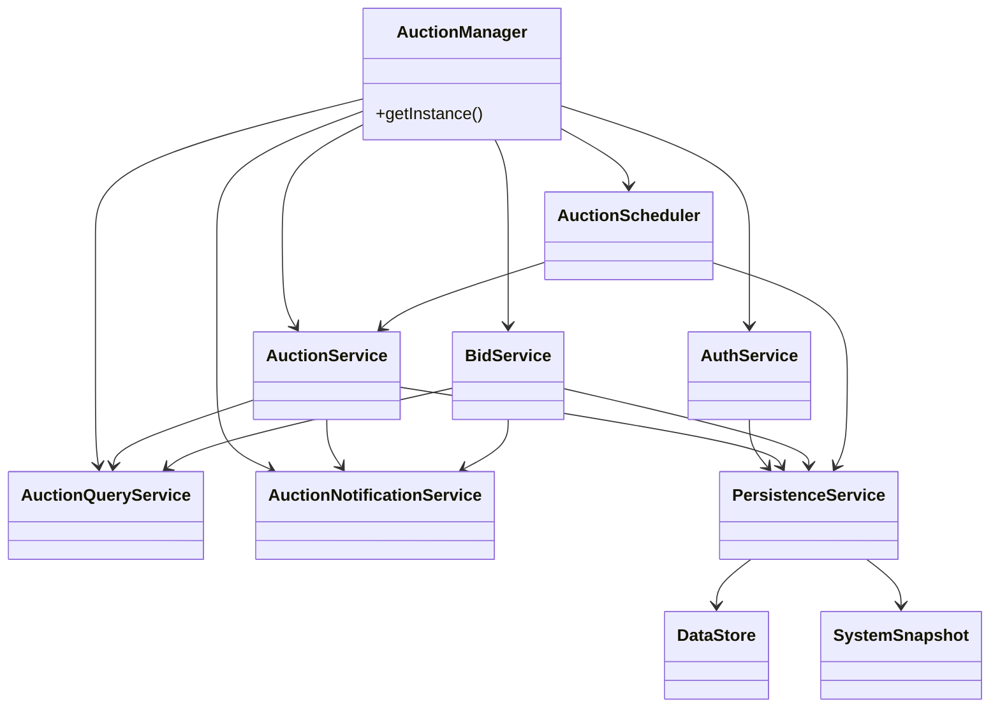
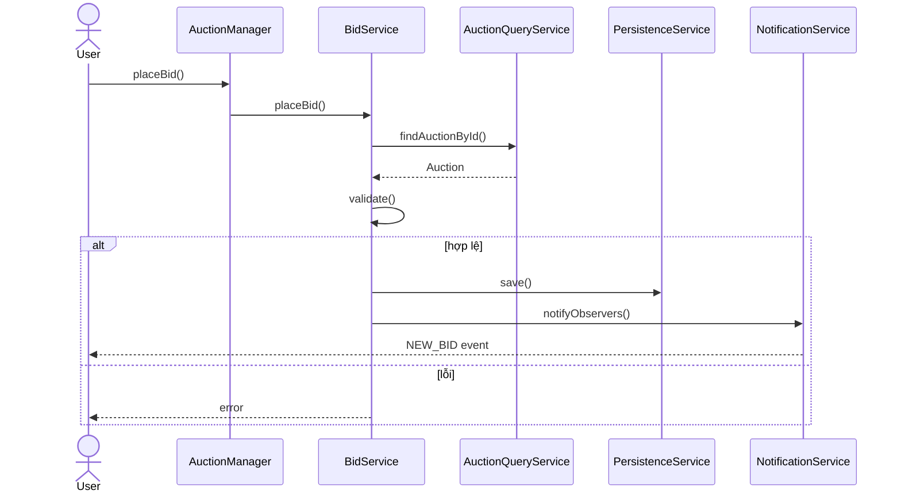
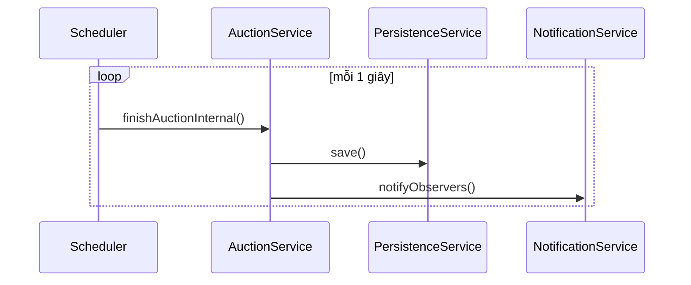

## 🧩 Architecture Diagram

### 🔷 Class Diagram (Mermaid)

```mermaid
classDiagram

class AuctionManager {
  +getInstance()
}

class AuthService
class AuctionService
class BidService
class AuctionQueryService
class AuctionNotificationService
class AuctionScheduler
class PersistenceService

class DataStore
class SystemSnapshot

AuctionManager --> AuthService
AuctionManager --> AuctionService
AuctionManager --> BidService
AuctionManager --> AuctionQueryService
AuctionManager --> AuctionNotificationService
AuctionManager --> AuctionScheduler

AuthService --> PersistenceService
AuctionService --> PersistenceService
BidService --> PersistenceService

AuctionService --> AuctionNotificationService
BidService --> AuctionNotificationService

AuctionService --> AuctionQueryService
BidService --> AuctionQueryService

PersistenceService --> DataStore
PersistenceService --> SystemSnapshot

AuctionScheduler --> AuctionService
AuctionScheduler --> PersistenceService
```

---

### 🔷 Flow: Đặt giá (Place Bid)

```mermaid
sequenceDiagram

actor User
participant AuctionManager
participant BidService
participant AuctionQueryService
participant PersistenceService
participant NotificationService

User ->> AuctionManager: placeBid()
AuctionManager ->> BidService: placeBid()

BidService ->> AuctionQueryService: findAuctionById()
AuctionQueryService -->> BidService: Auction

BidService ->> BidService: validate()

alt hợp lệ
    BidService ->> PersistenceService: save()
    BidService ->> NotificationService: notifyObservers()
    NotificationService -->> User: NEW_BID event
else lỗi
    BidService -->> User: error
end
```

---

### 🔷 Flow: Scheduler tự động đóng auction

```mermaid
sequenceDiagram

participant Scheduler
participant AuctionService
participant PersistenceService
participant NotificationService

loop mỗi 1 giây
    Scheduler ->> AuctionService: finishAuctionInternal()
    AuctionService ->> PersistenceService: save()
    AuctionService ->> NotificationService: notifyObservers()
end
```

---
